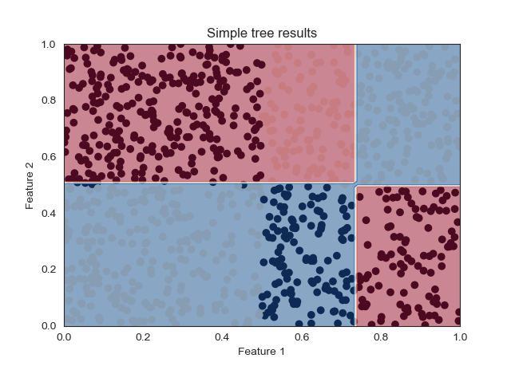
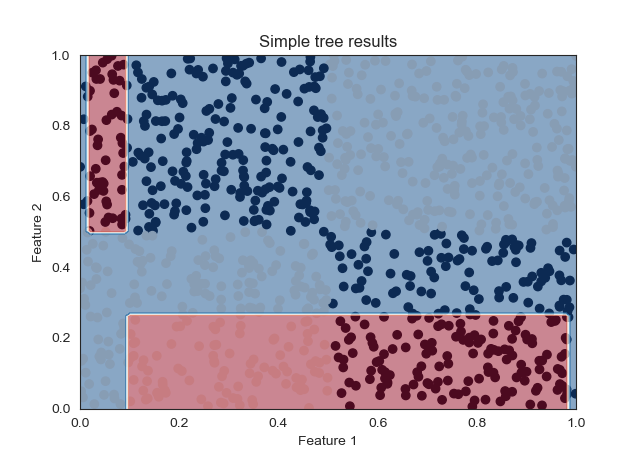
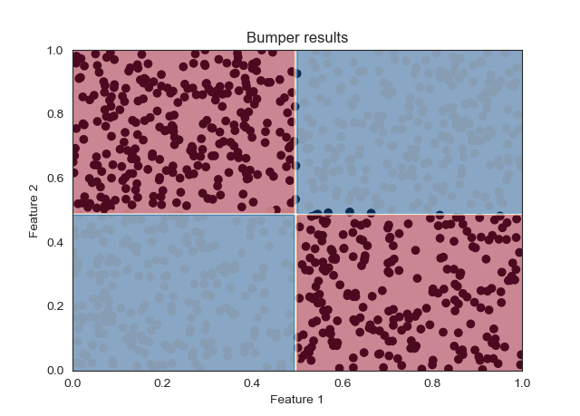
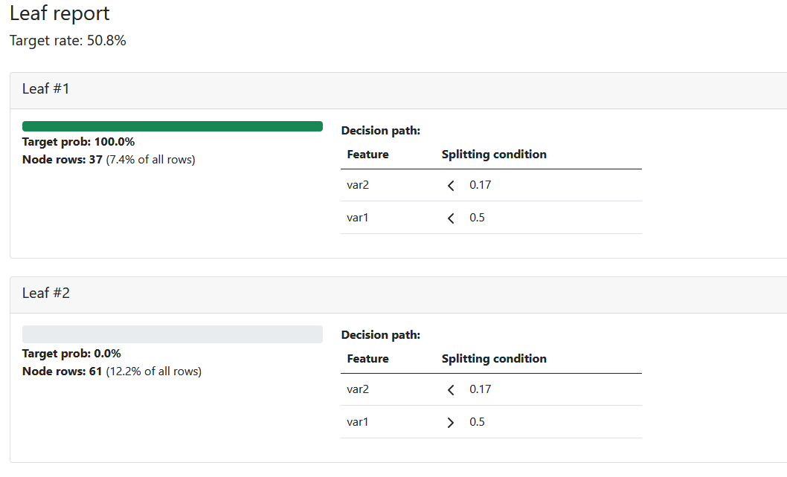

# Some useful extensions of scikit-learn DecisionTreeClassifier

## Abstract

This set of modules contains some useful extensions of the standard scikit-learn decision tree classifier.

Each extension is found in a separate Python module, and each extension has one accompanying testing module for demonstration.

The extensions are:
1. "bumper" algorithm
2. leaf report
3. visualization of decision boundaries for two top-most splits
4. visualization of decision boundaries projected on the space of two principal components (two leading PCA components)

In the followin sections I briefly discuss each extension.

## 1. Bumper

Bumper algorithm is briefly explained in "The elements of statistical learning" by Hastie et al.
In particular, in 2nd edition of the book you can find it in section 8.9.

The book describes the method as follows:

```
Bumping uses bootstrap sampling to move randomly through model space. 

For problems where fitting method finds many local minima, 
bumping can help the method to avoid getting stuck in poor solutions.
```

In a few more words, what bumper algorithm does, is it uses bootstrap resampling to find better decision tree models. It achieves better performance if the original model was unable to reach optimal state due to symmetries in the data (see the reference below) or if randomness in the data led it to converge to a sub-optimal configuration (something like a local minimum).
Bumper aims to address the problems with randomness in the data by building many models on different bootstrap resamples of the data - not on the original data itself. To eliminate fears of model building on something that's not the "observed data", it helps to think of it this way: the original data may lead our model to behave worse than optimal, but we may take this data only as means to generaate the empirical distribution. From this empirical distribution we build bootstrap resamples of the observed data (i.e. fake or proxy observed data, assuming underlying empirical distribution) and build models on top of that.
While models are being built on bootstrap resamples of the observed data, they are tested on the validated and chosen based on the performance on "the real thing".

Some examples of the situation described in the above discussion can be generated using ```test bumper.py``` module. 
Consider the following figure which displays a tree that failed to identify boundaries which are easy to spot just by looking at the distribution. (Red and blue are decision regions; generated data is shown as scatterplot underneath it. Target and non-target are shown as points of different color.)


Branching the tree further out doesn't help. This is an example of a four-level tree which made some mistakes early on and which were only compounded further in the subsequent splits.


The reason for the failure of the two-level tree, and the reason four-level tree can't be any better are both the same - CART algorithm is a greedy algorithm and mistakes made at any point cannot be fixed downstream.

Two-level bumper tree is shown in the next figure, and four-level bumper looks almost the same so I omit it.
It is worth mentioning that these examples are not cherry-picked by any means, as you can verify yourself by running the code. While bumper may occasionally underperform simple tree I found this to be a truly rare occasion indeed. 



An implementation of the bumper class can be found in the module ```bumper.py```. I wrote it by borrowing (heavily) from [this resource](https://betatim.github.io/posts/bumping/). 
The algorithm is described very well in the above reference, so I will limit my comments here to changes compared to the referenced code.

* Bumper class takes a few additional parameters for the DecisionTreeClassifier
* It takes an additional ```scoring_metric``` parameter which specifies model quality metric which is used to determine which bootstrap resampled (bumped?) tree is the best
* There is an additional ```score_model``` function which can be used to generate a dictionary of model scores

Note that the class cannot be written by inheriting directly from DecisionTreeClassifier. Having found the optimal model, for almost any purpose we wish to use ```best_estimator_``` only. (This is what contains our DecisionTreeClassifier model.) I usually do a deep copy of this object and discard the rest of the bumper in practice.


## 2. Leaf report

The code discussed in this section can be used to generate reports such as this one:



In particular, this example consists of:
* `leaf_report.py`, which contains the main logic
* `test leaf report.py`, which shows how to use `get_leaf_report()` function from the `leaf_report.py` module
* `leaf_report_template.html`, which is a an html template compiled by `test leaf report.py` via jinja into the final report
* `leaf_report.html`, is an example of the final report, whose top two leaf nodes are shown in the figure above.

### 2.1 html report
Let me briefly comment on the libraries used to build the reports.
`test leaf report.py` script is using jinja2 templating engine to generate the final report by filling out template of the report. The template therefore uses some simple jinja2 logic.
Additionally, Bootstrap library is used to give the report a nice and clean look.
Finally, feather icons are used to display greater-than and smaller-than symbols in splitting conditions.

As for the presentation of the data, it is organized as follows.
Each leaf node of the tree is shown in one Bootstrap card.
Each card has two columns.
Left column displays a bar. The bar will be green if the target rate in the leaf node is >60%, red if it is <40%, and yellow otherwise.
To understand size of the node at a glance, thickness of the bar will depend on the share of all rows that end up in the given leaf node.
Exact target rate and number and share of rows are displayed below the bar.
Finally, right column displays decision path leading from the root node to the leaf node. The path is taken from the top to the bottom.

It is often convenient to display leaf report side-by-side with decision tree diagram and/or other data such as ROC curves and quality metrics.

### 2.2 test script
`test leaf report.py` script is here for demonstration purposes only and it uses the same synthetic chess-board data used in the `test bumper.py` example. This example is not ideal for demonstrating usefulness of the leaf report, since there's no complex structure in data.

Nonetheless, test script demonstrates all key ingredients. It begins by creating a synthetic dataset (pandas.DataFrame), it prepares jinja, it trains a simple, standard scikit-learn DecisionTreeClassifier (even though everything works with Bumper just as well), and finally it uses jinja to compile the final report.


### 2.3 the logic
The logic of leaf reports is primarily included in  `get_leaf_report()` function in `leaf_report.py` module. This logic is not overly complex, but it is not trivial either. The main problem to overcome is the fact that scikit-learn does not expose a simple and intuitive API to obtain required information.

The function is very heavily commented so I will not discuss it here in detail. Instead, let me guide you through what the function does from "high-level" perspective.

The function will gather info on nodes such as who's whose child. It will also get info on features and thresholds (on features) used to split each node.
Next, it will determine three things for each node in the tree: is the node a leaf node, who is its parent, and what is its depth?
In order to do this, we need to use a stack to run through the binary tree data structure.

Having extracted info on tree structure, the function proceeds to calculate a table whose rows are leaf nodes and whose columns tell us the number of non-targets and targets per node. An additional column provides us with the target rate (share of target rows among all rows that end up in the node).

At this point the function uses the extracted tree structure to determine decision path leading from the root to each leaf node. Decision paths are stored in a list such that each element of the list is one decision path, and each decision path consists of lists with three elements: feature on which the node splits, condition (less-or-equal or greater-than) and the threshold.

Finally, data is put in a convenient (debatable) structure to be returned.
Returned data is as follows: there is one float, giving you the overall target rate (at the level of root), and one list. The list contains the leaf report in the form of one dict per leaf node. 

For each leaf node in the list, its corresponding dict will contain the following data:
* `target_prob` - share of target rows in the leaf node
* `total_rows` - total number of rows in the leaf node
* `share_rows` - share of all rows in the dataset that ended up in the leaf node
* `decision_path` - a nested list of splitting conditions to reach the leaf from the root

I hope by now it is quite clear what I meant that building leaf reports is not complicated, but is not trivial either. The resulting data structure is a bit more complex than what one would like to work with. It would definitely be convenient to have a scikit-learn API exposing this data more easily. In the meantime, I'm using this workaround.


## Decision boundaries at the tree-top
Implementation in Plotly...
Can be embedded in ...

## Decision boundaries in PCA space
Useful for qualitative estimation of tree performance ...